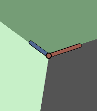
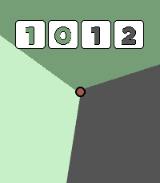
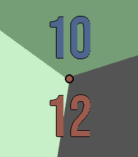
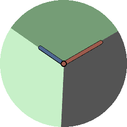
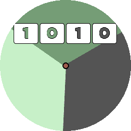
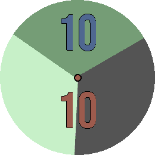

# TrioWay

TrioWay is a three-colour Pebble watchface with analogue and digital layouts.

It focuses on clean geometry, readable time, and calm muted palettes rather than feature-heavy complication stacks.

## Supported Watches

- Pebble Time 2 (`emery`)
- Pebble Round 2 (`gabbro`)

## Why I Designed It

I designed TrioWay because most digital watchfaces felt either busy or plain.

I wanted something that still felt like a proper watch at a glance: balanced, attractive, and easy to read. I also wanted the colour combinations to feel intentional and usable day-to-day, not loud for the sake of being loud.

## Preview

### Pebble Time 2 (`emery`)

### Pebble Round 2 (`gabbro`)

