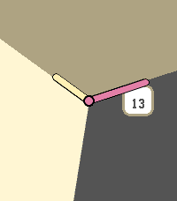
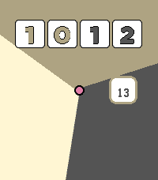
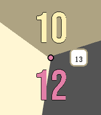
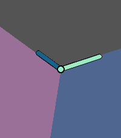
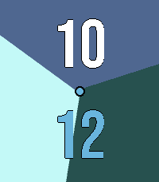
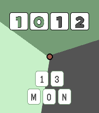

# TrioWay

TrioWay is a Pebble Time 2 watchface with animated three-sector geometry, configurable complications, and preset-driven colour themes.

This project and supporting scripts were generated with GPT-5.3-Codex.

## Design Rationale

This watchface is built around a simple goal: make a watch that looks genuinely nice at a glance.

- The design favours visual clarity and pleasing composition over feature-heavy complication stacks.
- Step and weather complications were intentionally deprioritised, because their utility is not worth the performance trade-off for this watchface.
- The face is designed to look good in both analogue and digital modes.
- Most digital watchfaces lose the aesthetic strengths of analogue watches; TrioWay aims to preserve that same sense of balance, tone, and style in digital layouts.

## Current Feature Set

- Three face modes:
  - `hands` (analogue)
  - `digital` (digital small)
  - `largedigital` (digital large)
- Dynamic three-colour sector background driven by hour/minute angles.
- Optional analogue hands in analogue mode.
- Day/date tile complication near 6 o'clock (when enabled and supported by mode).
- Rounded-square date complication near 3 o'clock:
  - supported in analogue, digital small, and digital large.
- Centre cap dot rendered in all modes to mask sector seam artefacts.
- Separate colour controls for:
  - background/hour/minute sector colours
  - hour/minute hand colours
  - complication background/border/text colours
- Preset themes snapped to Pebble Time 2 palette-safe colours.

## Default Watchface

Default is now **Sand Graphite + 3 o'clock complication**:

- mode: `hands`
- show hands: `true`
- show date complication: `true`
- show date tiles: `false`

## Preview

Default theme and key mode variants:





Additional muted presets:





## Presets

Muted presets added:

- `sandGraphite`
- `dustPlum`
- `coastalInk`
- `sageStone`
- `fogSlate`

Removed presets:

- `blushPop`
- `coralCandy`
- `glacierNavy`
- `oliveSteel`

## Build and Install

From project root:

```bash
pebble build
pebble install --emulator emery
```

If your local environment needs explicit Pebble SDK toolchain path:

```bash
export PEBBLE_HOME="$HOME/Library/Application Support/Pebble SDK"
export PEBBLE_SDK_VERSION="4.9.148"
export PEBBLE_TOOLCHAIN_BIN="$PEBBLE_HOME/SDKs/$PEBBLE_SDK_VERSION/toolchain/bin"
export PATH="$PEBBLE_TOOLCHAIN_BIN:$PATH"
```

## Configuration

Open watchface settings from Pebble app config page to update:

- face mode
- show hands
- show day/date tiles
- show 3 o'clock date complication
- preset selection
- colour selections for sectors/hands/complication

## Mock and Screenshot Workflows

Generated screenshots are stored in:

- `mockups/preset_matrix_emery_real/`

Primary compare/sort gallery:

- `mockups/preset_matrix_emery_real/index_compare.html`

### Deterministic Capture Script

Use:

- `mockups/capture_real_preset_matrix_emery_build_override.js`

This script supports:

- deterministic state overrides (mode/colours/complication/time)
- transport selection:
  - `--transport=emulator`
  - `--transport=qemu`
  - `--transport=auto`
- resumable runs with explicit queue start:
  - `--start-at=<1-based-index>`
- bounded batches:
  - `--limit=<count>`
- capture time override:
  - `--time=HH:MM:SS` (default `10:10:00`)

Example:

```bash
node mockups/capture_real_preset_matrix_emery_build_override.js --transport=emulator --start-at=75 --limit=20
```

### Full Batch Capture (Auto Reset Every 35)

Use the batch wrapper to run the full queue in `35` capture chunks with full emulator reset/setup between batches:

```bash
./mockups/capture_real_preset_matrix_emery_batches.sh
```

Resume from a specific queue index:

```bash
./mockups/capture_real_preset_matrix_emery_batches.sh 71
```

Custom batch size (optional second arg):

```bash
./mockups/capture_real_preset_matrix_emery_batches.sh 1 35
```

Set capture time (optional third arg), for example `10:12:00`:

```bash
./mockups/capture_real_preset_matrix_emery_batches.sh 1 35 10:12:00
```

This wrapper runs your required flow each batch:

- exports Pebble SDK env vars
- kills lingering emulator/QEMU processes
- writes `settings.json`
- runs `pebble wipe --everything`
- runs `pebble sdk install "$PEBBLE_SDK_VERSION"`
- removes `.capture.lock`
- runs capture with `--transport=emulator --start-at=<n> --limit=35`

## Notes

- Capture runs are long and emulator stability may vary; resume with `--start-at` and/or `--limit` as needed.
- `index_compare.html` is intended for visual comparison by preset/type (for example, comparing `analogue_comp_6` across all presets).
